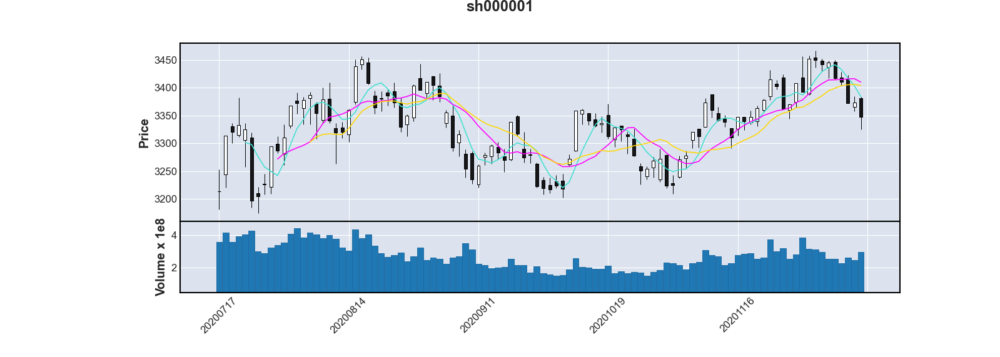

# 股票预测

基于爬虫爬取的沪、深股市各股票数据训练神经网络模型，以对股票的涨跌进行预测。

## 数据爬取与预处理

股票数据使用相关平台的公开接口（见参考1），这些接口均直接返回json格式数据，因此可以简化我们的工作。

为避免重复的文件读写，数据的部分预处理工作也在爬取部分进行。

### 爬取股票列表


为了获取股票的交易数据，首先我们需要获取所有股票的代码（如上证综指：sh000001）的列表。该接口允许我们每次获取五百个股票的代码、名字、最近的交易日的交易数据的相关数据（见上图）。我们感兴趣的是代码和名字。

在这里为方便我们直接使用`request`库进行爬虫。数据被保存在`./stock_list.csv`中

```python
def stock_list_spider():
    # 默认添加三个全局指数
    stock_list = pd.DataFrame(
        data={"symbol": ["sh000001", "sz399001", "sh000300"], "name": ["上证指数", "深证成指", "沪深300"]})
    # stock_list = [{'symbol': 'sh000001', 'name': '上证指数'}, {
    #     'symbol': 'sz399001', 'name': '深证成指'}, {'symbol': 'sh000300', 'name': '沪深300'}]
    stock_list_url_base = 'http://money.finance.sina.com.cn/d/api/openapi_proxy.php'
    print("爬取股票列表中...")
    cnt = 0

    # 循环爬取股票
    while(True):
        cnt += 1
        # 该接口的参数列表，500为该接口一次支持的最大爬取数量
        r_params = {'__s': '[["hq","hs_a","",0,' + str(cnt) + ',500]]'}
        response = requests.get(stock_list_url_base, r_params)
        # 如果爬取到的数据数量为空，则说明已经没有更多股票，退出。
        if(len(response.json()[0]['items']) == 0):
            break
        # 向列表添加该股票
        for item in response.json()[0]['items']:
            stock_list = stock_list.append(
                {'symbol': item[0], 'name': item[2]}, ignore_index=True)

    print(f"爬取 {stock_list.shape[0]} 支股票")

    # Review: 需要保存嘛？
    # 保存股票列表至./stock_list.csv
    stock_list.to_csv("./stock_list.csv", index=False)

    return stock_list
```

```python
stock_list = stock_list_spider()
```

### 预处理：剔除ST股

ST意味Special Treatment，适用于财务状况或其它状况出现异常的上市公司。因此我们对于这些公司的交易数据不感兴趣。

```python
stock_list = stock_list[~stock_list["name"].str.contains("ST")]
stock_list.reset_index()
print(f"清洗ST股后剩余 {stock_list.shape[0]} 支")
```

### 爬取股票交易数据

我们的接口支持以股票代码为参数爬取该股票近100个交易日的数据，并将其保存为美股常用的OHLC格式的csv，交易数据被保存在`./data/[symbol].csv`文件中

```python
def stock_data_spider(stock: str):
    stock_data_url_base = 'http://data.gtimg.cn/flashdata/hushen/latest/daily/'
    stock_data_dir = "./data"
    # DOHLCV：日期 开盘 最高 最低 收盘 交易量
    stock_data_header = ["date", "open", "high", "low", "close", "volume"]

    url = stock_data_url_base + stock + ".js"
    response = requests.get(url)
    data_list = response.text.split("\\n\\")[2:-1]  # 剔除标题信息以及最后一行垃圾信息

    # print(f"完成爬取股票{stock}")

    # 保存至./data/[股票代码].csv
    file = open(stock_data_dir+'/'+stock+".csv",
                'w', newline='', encoding='utf-8')
    file_writer = csv.writer(file)
    file_writer.writerow(stock_data_header)
    for data in data_list:
        data_array = data.strip().split(' ')
        # 接口的数据格式为 日期 开盘 收盘 最高 最低 交易量
        # 这里需要手动修改格式
        file_writer.writerow([datetime.strptime(data_array[0], "%y%m%d").date(), data_array[1], data_array[3],
                              data_array[4], data_array[2], data_array[5]])
    file.close()

    # 输出获得的首个交易日期及数据长度（默认100个）
    first_date = datetime.strptime(
        data_list[0].strip().split(' ')[0], "%y%m%d").date()
    return {"first_date": pd.Timestamp(first_date), "data_lens": len(data_list)}
```

爬取各支股票数据的过程互不干扰，这里我们可以加入多线程同时执行爬虫。

```python
stock_data_dir = "./data"
if not os.path.exists(stock_data_dir):
    os.makedirs(stock_data_dir)
mapfunc = partial(stock_data_spider)
pool = Pool(os.cpu_count())
stock_data_dict = pool.map(mapfunc, stock_list["symbol"])   # 多线程执行下载工作
pool.close()
pool.join()
print(f"完成爬取 {len(stock_data_dict)} 支")
```

### 预处理：检查交易日

我们需要长期稳定运行的股票进行分析，故在这里剔除交易数据不足一百天的新股。又一些股票因为各种原因在这一百个交易日内会出现停盘情况，根据我们获取的该股票首个交易日与大盘数据的首个交易日进行比对，可以剔除这些股票。

```python
stock_list = stock_list.join(pd.DataFrame(data=stock_data_dict))
stock_list = stock_list[stock_list["data_lens"] == 100]
print(f"清洗交易日不满一百的股票后剩余 {stock_list.shape[0]} 支")
first_date = stock_list.loc[stock_list["symbol"] == "sh000001"].at[0,"first_date"]
stock_list = stock_list[stock_list["first_date"] == first_date]
print(f"清洗首个交易日与大盘数据不同的股票后剩余 {stock_list.shape[0]} 支")
```

## 交易数据可视化

Python为交易数据可视化提供了方便的轮子，mplfinance库最早是Matplotlib的一个内部组件，现在为一个独立库，但依旧依赖于Matplotlib。这里我们以sh000001上证综指为例，对K线图，5、10、15天均线，成交量数据进行可视化。

```python
def stock_plot(symbol: str):
    stock_data = pd.read_csv("./data/" + symbol + ".csv",
                             index_col=0, parse_dates=True)
    stock_data.index.name = "Date"
    mpf.plot(stock_data, type='candle', mav=(5, 10, 15), volume=True,
    title=symbol, datetime_format="%Y%m%d")
    return


stock_plot("sh000001")
```



## 交易数据分析

### 统计分析

### KDJ指数

随机指标(KDJ)一般是根据统计学的原理，通过一个特定的周期（常为9日、9周等）内出现过的最高价、最低价及最后一个计算周期的收盘价及这三者之间的比例关系，来计算最后一个计算周期的未成熟随机值RSV，然后根据平滑移动平均线的方法来计算K值、D值与J值，并绘成曲线图来研判股票走势。

随机指标(KDJ)是以最高价、最低价及收盘价为基本数据进行计算，得出的K值、D值和J值分别在指标的坐标上形成的一个点，连接无数个这样的点位，就形成一个完整的、能反映价格波动趋势的KDJ指标。它主要是利用价格波动的真实波幅来反映价格走势的强弱和超买超卖现象，在价格尚未上升或下降之前发出买卖信号的一种技术工具。它在设计过程中主要是研究最高价、最低价和收盘价之间的关系，同时也融合了动量观念、强弱指标和移动平均线的一些优点，因此，能够比较迅速、快捷、直观地研判行情。

### 数学公式

计算KDJ值，首先需要计算第n日的未成熟随机值RSV：

$$RSV(n)=\frac{C_n-L_n}{H_n-L_n}\times100$$

其中$C_n$为第n日收盘价，$L_n$为n日中的最低价，$H_n$为n日中的最高价。RSV值在0-100间波动。

随后可以计算第n日的K、H、J值：

$$K_n=\frac{2}{3}K_{n-1}+\frac{1}{3}RSV_n$$

$$D_n=\frac{2}{3}D_{n-1}+\frac{1}{3}K_{n}$$

$$J_n=3D_n-2K_n$$

## 机器学习预测股票数据

## 参考资料

1. 股票接口：https://blog.csdn.net/luanpeng825485697/article/details/78442062 